```mermaid
graph LR
    A[🔥 Current Focus] --> B[📚 Master AI/ML]
    B --> C[🌐 IoT Innovation]
    C --> D[✍️ Tech Content]
    D --> E[🚀 Startup Launch]
    E --> F[🌟 Open Source Lead]
    
    style A fill:#00FFFF,stroke:#00FFFF,stroke-width:2px,color:#000
    style B fill:#A9FEF7,stroke:#00FFFF,stroke-width:2px,color:#000
    style C fill:#A9FEF7,stroke:#00FFFF,stroke-width:2px,color:#000
    style D fill:#A9FEF7,stroke:#00FFFF,stroke-width:2px,color:#000
    style E fill:#A9FEF7,stroke:#00FFFF,stroke-width:2px,color:#000
    style F fill:#A9FEF7,stroke:#00FFFF,stroke-width:2px,color:#000
```

# 🌟 Welcome 🌟

<div align="center">


<div align="center">
  
</div>

</div>

<div align="center">
  
[](https://git.io/typing-svg)

</div>

<div align="center">
  
</div>

<div align="center">
  
</div>

---

<table align="center">
<tr>
<td align="center" width="50%">


</td>
<td align="center" width="50%">

### 🎓 Academic Journey

**🏛️ Vellore Institute of Technology**  
**📍 Chennai, India**  
**📅 2021 - 2026**  
**🎯 M.Tech Integrated**  
**💼 Software Engineering**

<br>


</td>
</tr>
</table>

---

## 🚀 About Me 

<table>
<tr>
<td width="50%" valign="top">

### 👨‍💻 Quick Stats


</td>
<td width="50%" valign="top">

### 💡 Who Am I?

```javascript
const abhishek = {
  location: "Chennai, India 🇮🇳",
  education: "VIT Chennai - MTech Integrated",
  specialization: "Software Engineering",
  interests: ["AI/ML", "IoT", "Full Stack Dev"],
  currentlyLearning: ["Deep Learning", "NLP", "Cloud"],
  lookingFor: "Job Referrals & Collaborations",
  hobbies: ["Coding", "Problem Solving", "Tech Blogging"],
  motto: "Building the future, one commit at a time! 🚀"
};
```

**📧 Email:** [abhi11.sbsm@gmail.com](mailto:abhi11.sbsm@gmail.com)  
**🤝 Open to:** Software & IoT Collaborations  
**⚡ Fun Fact:** I debug with coffee and determination! ☕

</td>
</tr>
</table>

---

<div align="center">
  
</div>

## 🛠️ Tech Arsenal 

<details open>
<summary><b>🎨 Frontend Development</b></summary>
<br>
<div align="center">
  


</div>
</details>

<details open>
<summary><b>⚙️ Backend Development</b></summary>
<br>
<div align="center">
  


</div>
</details>

<details open>
<summary><b>🗄️ Database & Cloud</b></summary>
<br>
<div align="center">
  


</div>
</details>

<details open>
<summary><b>🤖 AI/ML & Data Science</b></summary>
<br>
<div align="center">
  


</div>
</details>

<details open>
<summary><b>🔧 Tools & Technologies</b></summary>
<br>
<div align="center">
  


</div>
</details>

---

<div align="center">
  
</div>

## 🯠Featured Projects 

<div align="center">

<table>
<tr>
<td width="50%">

### 💳 LedgerStream: Distributed Payment System
**`Flutter` `Python` `SQL` `Docker` `gRPC`**


🐳 Containerized FastAPI microservices architecture  
🔐 Fraud detection & transaction processing  
⚡ gRPC contracts with automated protobuf generation  
🗄️ PostgreSQL-backed end-to-end payments flow  
📱 Flutter & Web control center UI  

[](https://github.com/abhishek-7-singh/LedgerStream-Distributed-payments)

</td>
<td width="50%">

### 📜 GovCertify: E-Governance Platform
**`Next.js` `Prisma` `MongoDB` `TypeScript`**


🏛️ Microservice-based certificate issuance system  
📋 Automated vital records (Birth, Death, Marriage)  
👥 Multi-registrar workflow supporting 4000+ registrars  
🔒 Secure processing, verification & approval  
⚡ 500MB data handling with 1-second uploads  

[](https://github.com/abhishek-7-singh/e-certificate)

</td>
</tr>
<tr>
<td width="50%">

### 🚗 IoT Predictive Maintenance System
**`Flutter` `Node.js` `Arduino` `LSTM` `Firebase`**


🔧 Real-time IoT system using ESP32  
🤖 LSTM models for engine carbon buildup prediction  
📊 96% accuracy score, no OBD-II required  
⚡ Sub 1-second latency real-time alerts  
📱 Cross-platform Flutter diagnostic app  

[](https://github.com/abhishek-7-singh/vehicle_monitoring)

</td>
<td width="50%">

### 🐧 QWEN OS: LLM-Based Linux System
**`Python` `OCR` `Shell` `Ollama` `Phi-3`**


🖥️ Custom Linux OS with embedded offline LLM  
🧠 Phi-3:3.8b model integration  
🔍 OCR, Circle-to-Search microservices  
💬 Natural-language terminal control  
🛠️ VS Code extension for AI-powered coding  

[](https://github.com/abhishek-7-singh/QWEN-OS--LLM-BASED-LINUX-SYSTEM)

</td>
</tr>
</table>

</div>

## 🆠GitHub Trophies & Achievements 

<div align="center">
  
[](https://github.com/ryo-ma/github-profile-trophy)

</div>

<div align="center">

### 🎯 3D Contribution Graph


</div>

---

## 📊 GitHub Analytics 

<div align="center">
<table>
<tr>
<td width="50%">


</td>
<td width="50%">


</td>
</tr>
</table>
</div>

<div align="center">
  
[](https://github.com/abhishek-7-singh)

</div>

---

## 🅠Achievements & Milestones 

<div align="center">
  
[](https://github.com/ryo-ma/github-profile-trophy)

</div>

<table align="center">
<tr>
<td align="center" width="25%">

<br><b>Competitive Programming</b>
<br>Active on LeetCode & Codeforces
</td>
<td align="center" width="25%">

<br><b>Academic Excellence</b>
<br>MTech at VIT Chennai
</td>
<td align="center" width="25%">

<br><b>Innovation Focus</b>
<br>AI-powered IoT Solutions
</td>
<td align="center" width="25%">

<br><b>Open Source</b>
<br>Contributing to Community
</td>
</tr>
</table>

---

## 🯠2025 Roadmap 

<div align="center">



</div>

<table align="center">
<tr>
<td align="center" width="20%">

<br><b>Learn</b>
<br>Advanced AI/ML & Deep Learning
</td>
<td align="center" width="20%">

<br><b>Build</b>
<br>Smart IoT Solutions
</td>
<td align="center" width="20%">

<br><b>Write</b>
<br>Tech Blogs & Tutorials
</td>
<td align="center" width="20%">

<br><b>Contribute</b>
<br>Open Source Projects
</td>
<td align="center" width="20%">

<br><b>Launch</b>
<br>Tech Startup
</td>
</tr>
</table>

---

## 📠Latest Blog Posts & Activity 

<div align="center">

<!-- BLOG-POST-LIST:START -->
🔜 **Coming Soon:** Tech blogs on AI, IoT, and Full Stack Development!
<!-- BLOG-POST-LIST:END -->

</div>

---

## 🌠Connect With Me 

<div align="center">

<table>
<tr>
<td align="center" width="25%">
<a href="https://github.com/abhishek-7-singh">

<br>
</a>
</td>
<td align="center" width="25%">
<a href="https://linkedin.com/in/abhishek-singh-052b24220">

<br>
</a>
</td>
<td align="center" width="25%">
<a href="https://x.com/Abhishek_28_9">

<br>
</a>
</td>
<td align="center" width="25%">
<a href="mailto:abhi11.sbsm@gmail.com">

<br>
</a>
</td>
</tr>
</table>

<br>

[](https://visitorbadge.io/status?path=abhishek-7-singh%2Fabhishek-7-singh)

</div>

---

<div align="center">

### 💭 Random Dev Quote


### 😂 Here's a Dev Joke for You!


</div>

---

<div align="center">


### 💫 *"Code is poetry written in logic"*


**⭐ If you find my work interesting, consider starring my repositories!**

**🤝 Open to collaborations and opportunities!**


</div>
